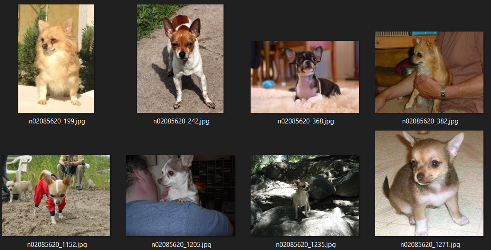
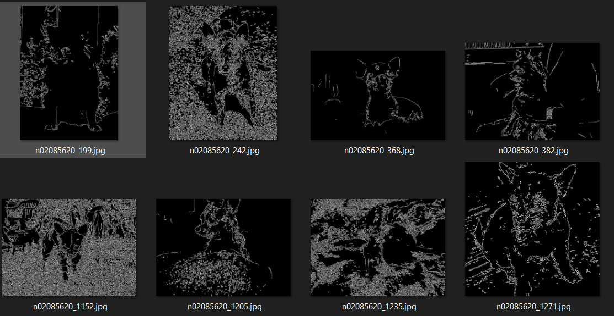
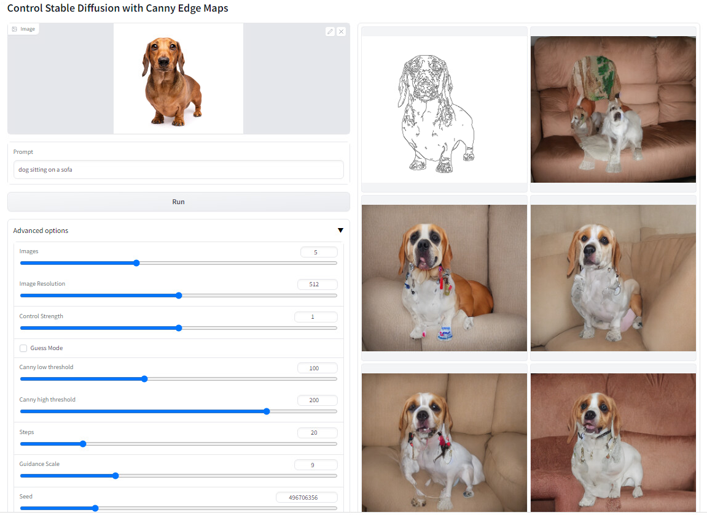
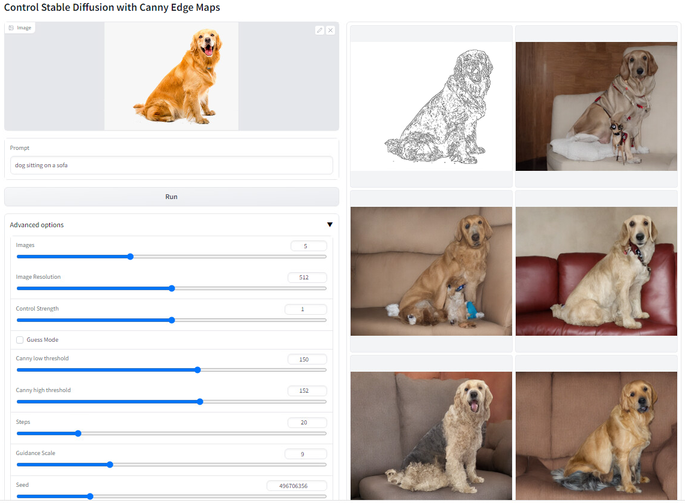
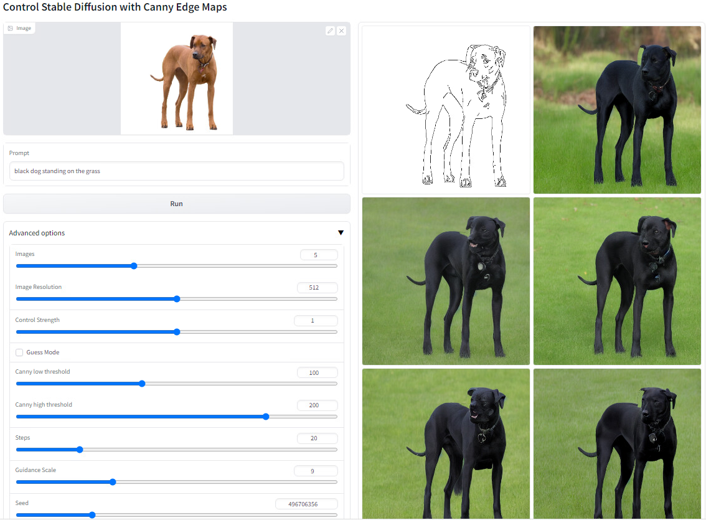

# Training ControlNet using Stable Diffusion
This readme file specifically focuses on Part1 (Training ControlNet) of the capstone assignment

## Introduction
This is a sub README file to capture the details on Training ControlNet. The complete process of training a ControlNet architecture is dividied into two parts:
- Part1: is dataset preperation, you need source image, target image and a prompt discribing the target image. Here souce image is detected edges of target image.
- Part2: is attaching Control part, training the new architecture and inference after training.

More details are coverd below.

## About ControlNet architecture
Before diving into training one, let quickly look into what is ControlNet architecture
</br>


ControlNet, an end-to-end neural network architecture that controls large image
diffusion models (like Stable Diffusion) to learn task-specific input conditions. The ControlNet clones
the weights of a large diffusion model into a "trainable copy" and a "locked copy": the locked copy
preserves the network capability learned from billions of images, while the trainable copy is trained
on task-specific datasets to learn the conditional control. The trainable and locked neural network
blocks are connected with an unique type of convolution layer called "zero convolution", where the
convolution weights progressively grow from zeros to optimized parameters in a learned manner.
Since the production-ready weights are preserved, the training is robust at datasets of different scale.

## Folder structure
Since the folder structure and files are little complex, lets quickly go through the some important files and structure of ControlNet training directory:
```
Part1-training_ControlNet/
  |
  ├── README.md                           <- readme file with documentation about training ControlNet
  |
  ├── output_images/                      <- folder containing inference output of trained model.
  |
  ├── part1_1-Dataset_preparation/        <- sub directory containing files to help in dataset generation for training ControlNet.
  │   ├── Part1_1-prepare_dataset.ipynb   <- Main notebook which should be executed in colab to generate dataset.
  │   ├── annotator/                      <- folder containing tools to generate Canny edge images given s source image.
  │   ├── Captioner/                      <- folder containing tools to generate prompt given source image.
  │   │   ├── blip_caption.py                <- script containing custom written class to perfrom inference using BLIP to generate prompts
  │   │   ├── models/                        <-folder containing model definiation for BLIP prompt generation. 
  │   ├── run_generation.py               <- Custom written script which given folder of images will generate canny images and prompts.
  │   ├── requirements.txt                <- text file containing python requirements.
  │
  ├── part1_2-Training_ControlNet/                   <- Sub directory containing files to help in architecture generation, training and inference
  │   ├── part1_2_training_inference.ipynb            <- Main notebook which should be executed after generating dataset to build, train and inference on ControlNet architecture.
  │   ├── training.py             <- Python file containing lightning code to train ControlNet architecture on a GPU.
  │   ├── inference.py            <- Python file containing pytorch code to run inference on trained ControlNet model on GPU.
  │   ├── dataset.py              <- Python file containing pytorch code to create Dataset instance from source, target, prompt.json generated by part1_1.
  │   ├── tool_add_control.py     <- Python script to attach Stable diffusion encoder as trainable copy with itself.
  │   ├── requirements.txt        <- text file containing requirements to build, train and infence on ControlNet architecture.
```

## Dataset representation
To train the ControlNet, I am using open source available dataset from [Standford Dog Dataset](http://vision.stanford.edu/aditya86/ImageNetDogs/) which contains approx 20,000 images for different breed of dogs.

Below image shows how the target image for training looks like:


</br>
This is how source image looks like after preperation:



## Getting started
Lets go through the steps to execute training using this repo:
1. Open notebook `Part1-training_ControlNet\part1_1-Dataset_preperation\Part1_1_prepare_dataset.ipynb` in colab and follow the notebook. In the end it will generate a dataset directory contianing following content:
    - `source/` folder containing canny edge images
    - `target/` folder containing original images from Standford dog dataset
    - `prompt.json` json file containing prompt and location to source and target image.

2. Once dataset has been generated and pushed to the drive, open notebook `Part1-training_ControlNet\part1_2-Training_ControlNet\part1_2_training_inference.ipynb` in colab and follow the notebook. you will first create ControlNet architecture and then you will train it on the dataset generted in step 1 and then inferene over it.

**That's it!**

But be aware of this few points:
- It might not be possible to run step2 on free tier of colab as the model needs more then 12GB of memory to load the model on CPU for creating ControlNet. Better to upgrade the colab version to pro.
- It is completely possible to run this notebooks on your capable local system. Infact for training and testing the model is originally trained on local system.
- We are downgrading python version from python3.10 to python3.8.10 as most of the libraries breaks at newer version of python. And the process can take some time.

## More information on part1 and part2
### part1_1: Dataset preperation
Lets talk about how the dataset is been prepared for the dataset. Below are the steps which the notebook takes to generate the dataset:

1. Download tar file containing the images in nested folder structure.
2. Move all the images from nested folder to main folder and delete empty nested folders.
3. Run `run_generation.py` while perform following steps:
    - get all images names as list
    - Generate output directory i.e. source, target in dataset.
    - pass each image from canny detector and save detected edges as image in source folder. Also copy input image to target.
    - Pass each image converted into PIL through instance of BlipCaption custom class to generate prompt.
    - write prompt.json.
4. Copy generated dataset to drive for futher training.

**NOTE**- You don't have to follow this steps manually. Just follow the respective colab notebook.

- custom class for prompt inference:
```
class BlipCaption():
    def __init__(self, device = 'cuda', 
                 model_url = 'https://storage.googleapis.com/sfr-vision-language-research/BLIP/models/model_base_capfilt_large.pth',
                 image_size = 384):
        self.device = device
        self.model_url = model_url
        self.model = blip_decoder(pretrained=model_url, image_size=image_size, vit='base').eval()
        self.model = self.model.to(self.device)
        self.image_size = image_size

    def __image_transform(self, image):
        raw_image = Image.open(image).convert('RGB')
        w,h = raw_image.size
        transform = transforms.Compose([
            transforms.Resize((self.image_size,self.image_size),interpolation=InterpolationMode.BICUBIC),
            transforms.ToTensor(),
            transforms.Normalize((0.48145466, 0.4578275, 0.40821073), (0.26862954, 0.26130258, 0.27577711))
            ]) 
        image = transform(raw_image).unsqueeze(0).to(self.device)   
        return image
    
    def generate_caption(self, image_path):
        image = self.__image_transform(image_path)
        with torch.no_grad():
            caption = self.model.generate(image, sample=False, num_beams=3, max_length=20, min_length=5)
            return caption[0]
```
### part1_2: Training ControlNet archirecture and inferenceing
Now lets talk about part1_2 training process:
1. Download and setup python3.8.10 version as most of the dependency needs python3.8.
2. Copy our dataset from drive to the current instance.
3. runs `tool_add_control.py` python script to generate our ControlNet architecture which we need to train.
4. Train this generated architecture on our prepared dataset.
5. Inference on your trained model!

I have trained this model in following config:
- Batch size = 11
- Slice attention = True
- Epoch = 13
- time taken = 24 hours

NOTE: Due to some dependency import error in colab, I have to implement all the code as python script. If you are using local machine then you can copy the code in main notebook itself.

## Training logs
As discussed, I have trained this model for 24 hours on a local machine with 16GB of GPU memory. Below is a snapshot of my training logs.

 ```
    Epoch 1:  16%|_| 300/1871 [17:33<1:31:56,  3.51s/it, loss=0.192, v_num=0, train/loss_simple_step=0.210, train/loss_vlb_step=0.0Data shape for DDIM sampling is (4, 4, 32, 32), eta 0.0
Running DDIM Sampling with 50 timesteps
DDIM Sampler: 100%|____________________________________________________________________________| 50/50 [00:27<00:00,  1.79it/s]
Epoch 1:  32%|_| 600/1871 [34:52<1:13:53,  3.49s/it, loss=0.202, v_num=0, train/loss_simple_step=0.223, train/loss_vlb_step=0.0Data shape for DDIM sampling is (4, 4, 32, 32), eta 0.0
Running DDIM Sampling with 50 timesteps
DDIM Sampler: 100%|____________________________________________________________________________| 50/50 [00:24<00:00,  2.06it/s]
Epoch 1:  48%|_| 900/1871 [52:08<56:15,  3.48s/it, loss=0.183, v_num=0, train/loss_simple_step=0.163, train/loss_vlb_step=0.000Data shape for DDIM sampling is (4, 4, 32, 32), eta 0.0
Running DDIM Sampling with 50 timesteps
DDIM Sampler: 100%|____________________________________________________________________________| 50/50 [00:24<00:00,  2.06it/s]
Epoch 1:  64%|_| 1200/1871 [1:09:30<38:52,  3.48s/it, loss=0.175, v_num=0, train/loss_simple_step=0.134, train/loss_vlb_step=0.Data shape for DDIM sampling is (4, 4, 32, 32), eta 0.0
Running DDIM Sampling with 50 timesteps
DDIM Sampler: 100%|____________________________________________________________________________| 50/50 [00:24<00:00,  2.03it/s]
Epoch 1:  80%|_| 1500/1871 [1:26:50<21:28,  3.47s/it, loss=0.18, v_num=0, train/loss_simple_step=0.206, train/loss_vlb_step=0.0Data shape for DDIM sampling is (4, 4, 32, 32), eta 0.0
Running DDIM Sampling with 50 timesteps
DDIM Sampler: 100%|____________________________________________________________________________| 50/50 [00:27<00:00,  1.84it/s]
Epoch 1:  96%|_| 1800/1871 [1:44:20<04:06,  3.48s/it, loss=0.174, v_num=0, train/loss_simple_step=0.135, train/loss_vlb_step=0.Data shape for DDIM sampling is (4, 4, 32, 32), eta 0.0
Running DDIM Sampling with 50 timesteps
DDIM Sampler: 100%|____________________________________________________________________________| 50/50 [00:24<00:00,  2.03it/s]
Epoch 2:   0%| | 0/1871 [00:00<?, ?it/s, loss=0.178, v_num=0, train/loss_simple_step=0.147, train/loss_vlb_step=0.000525, trainData shape for DDIM sampling is (4, 4, 32, 32), eta 0.0
Running DDIM Sampling with 50 timesteps
DDIM Sampler: 100%|____________________________________________________________________________| 50/50 [00:24<00:00,  2.07it/s]
Epoch 2:  16%|_| 300/1871 [17:29<1:31:37,  3.50s/it, loss=0.157, v_num=0, train/loss_simple_step=0.318, train/loss_vlb_step=0.0Data shape for DDIM sampling is (4, 4, 32, 32), eta 0.0
Running DDIM Sampling with 50 timesteps

...........
...........

Epoch 12:  64%|_| 1200/1871 [1:09:47<39:01,  3.49s/it, loss=0.163, v_num=0, train/loss_simple_step=0.164, train/loss_vlb_step=0Data shape for DDIM sampling is (4, 4, 32, 32), eta 0.0
Running DDIM Sampling with 50 timesteps
DDIM Sampler: 100%|____________________________________________________________________________| 50/50 [00:25<00:00,  1.98it/s]
Epoch 12:  80%|_| 1500/1871 [1:27:16<21:35,  3.49s/it, loss=0.156, v_num=0, train/loss_simple_step=0.218, train/loss_vlb_step=0Data shape for DDIM sampling is (4, 4, 32, 32), eta 0.0
Running DDIM Sampling with 50 timesteps
DDIM Sampler: 100%|____________________________________________________________________________| 50/50 [00:24<00:00,  2.03it/s]
Epoch 12:  96%|_| 1800/1871 [1:44:27<04:07,  3.48s/it, loss=0.161, v_num=0, train/loss_simple_step=0.155, train/loss_vlb_step=0Data shape for DDIM sampling is (4, 4, 32, 32), eta 0.0
Running DDIM Sampling with 50 timesteps
DDIM Sampler: 100%|____________________________________________________________________________| 50/50 [00:23<00:00,  2.09it/s]
Epoch 13:   0%| | 0/1871 [00:00<?, ?it/s, loss=0.137, v_num=0, train/loss_simple_step=0.0911, train/loss_vlb_step=0.000447, traData shape for DDIM sampling is (4, 4, 32, 32), eta 0.0
Running DDIM Sampling with 50 timesteps
DDIM Sampler: 100%|____________________________________________________________________________| 50/50 [00:23<00:00,  2.12it/s]
Epoch 13:  16%|_| 300/1871 [17:14<1:30:15,  3.45s/it, loss=0.182, v_num=0, train/loss_simple_step=0.151, train/loss_vlb_step=0.Data shape for DDIM sampling is (4, 4, 32, 32), eta 0.0
Running DDIM Sampling with 50 timesteps
DDIM Sampler: 100%|____________________________________________________________________________| 50/50 [00:24<00:00,  2.07it/s]
Epoch 13:  20%|_| 367/1871 [21:22<1:27:35,  3.49s/it, loss=0.16, v_num=0, train/loss_simple_step=0.0696, train/loss_vlb_step=0.Time limit reached. Elapsed time is 1 day, 0:00:03. Signaling Trainer to stop.
Epoch 13:  20%|_| 368/1871 [21:49<1:29:08,  3.56s/it, loss=0.154, v_num=0, train/loss_simple_step=0.106, train/loss_vlb_step=0.
```

## Inference output
Below are some inference output from the trained model:





## Conclusion
- Model when trained for lower epochs did not produce good results.
- Using slice attention can greatly increase the capacity to have larger batch size.
- Training for longer time can generate even better results
