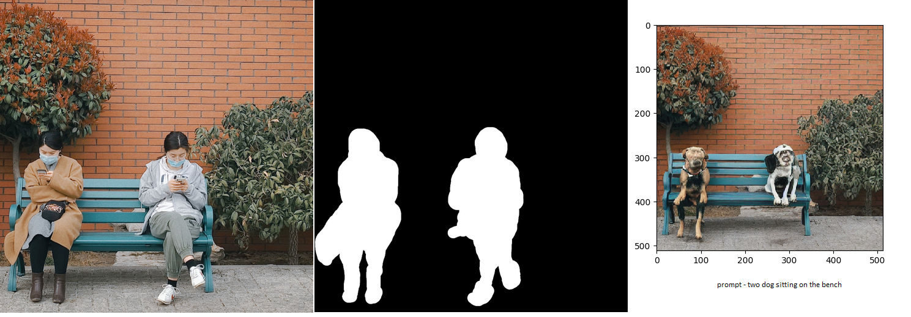

# Part2: Inpainting Inference Implementation
This readme file specifically focuses on Part2 (Inpaining Implementation) of the capstone assignment

## Introduction

## About Inpainting

## Getting started

## Attempts to implement Inpainting
### Attempt1: Using DiffusionPipeline
### Attempt2: Writing from scratch 
### Attempt3: Writing from scratch

## Inference output
Below are inference output from inpainting pipeline:

 
