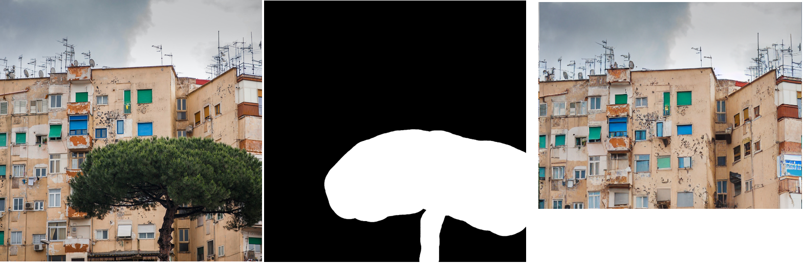

# Part2: Inpainting Inference Implementation
This readme file specifically focuses on Part2 (Inpaining Implementation) of the capstone assignment

## Introduction
his is a sub README file to capture the details on inference implementation of inpainting.
## About Inpainting

Image Inpainting, also known as Image Completion,
aims at filling missing regions within an image. Such inpainted regions need to harmonize with the rest of the image and be semantically reasonable. Inpainting approaches thus require strong generative capabilities
## Getting started
There are three attempts for inpainting. To get started you can open `Part2-Inpainting_implementation\Attempt3_Success.ipynb` notebook on colab and follow the instruction in the colab to run the inference implementation of inpainting.

NOTE- This implementation has been tested on colab free tier. So it will run with GPU access without any issue.
## Attempts to implement Inpainting
I went through total of three attempts to implement inpainting. Below lets discuss about this three implementation.

### Attempt1: Using DiffusionPipeline
This attempt is the simplest one, it uses DiffusionPipeline library to implement inpainting in fewer line of code. This implementation is not exactly from scratch but a good start to start with inpainting.
You can find the notebook implementation `Part2-Inpainting_implementation\Attempt1_DiffusionPipeline.ipynb` here.

### Attempt2: Writing from scratch 
This is the first attempt to implement the logic from scratch but it has "cuda out of memory" issue although the logic is some what correct where image+noice, mask image and mask is concatenated to generate latent of 9 channels for UNET. `Part2-Inpainting_implementation\Attempt2_cuda_error.ipynb`

### Attempt3: Writing from scratch
This is the final successful attempt in implementing inpainting from scratch. Here all major processes are written as function so that torch.no_grad() can be implemented correctly with not "cuda out of memory" issue.
`Part2-Inpainting_implementation\Attempt3_Success.ipynb`
## Inference output
Below are inference output from inpainting pipeline:

 
