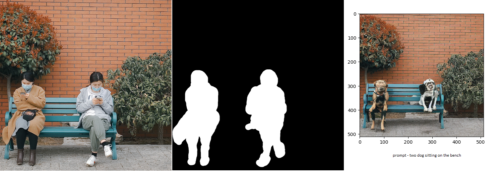

# EVA-8_Capstone_Assignment
This is the capstone assignment of Phase-1 of EVA-8 course from TSAI

## Introduction

## Part1: Training a ControlNet architecture on custom dataset
### Objective

### Getting started

### Training output

### Inference output

## Part2: Implementation of Inpainting using Stable Diffusion

### Objective

### Getting started

### Inference output

## Conclusion